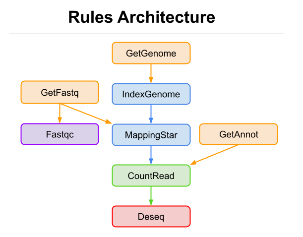

# Workflow

## Organization

* A subdirectory for each output of each rule (absent by default)
* A subdirectory "images" containing all the images of the tools (absent by default, you will have to copy it from "[Tools](../Tools/)")
* A subdirectory "[rules](./rules/)" with all the rules used in the workflow (one file per rule).
* A file "[configuration.yml](./configuration.yml)" containing all the necessary configurations for Reprochackthon.wf.
* A Snakefile "[ReproHackathon.wf](./ReproHackathon.wf)" with the workflow.
* A [README](./README.md) file

## Resume


## Setup

## Singularity 

You can check the read-me from [Tools](../Tools/) about [Singularity](../Tools/README.md/#install-singularity) installation.

## Snakemake

### Using Anaconda (didn't work for me)
```bash
conda activate base
mamba create -c conda-forge -c bioconda -n snakemake snakemake
conda activate snakemake
```
### Using Python (Worked for me)
```bash
pip install snakemake
```

### Using Bash (worked for me ...)
```bash
sudo apt install snakemake
```

### Check Installation
```bash
singularity --version
snakemake -v  
```

## Prepare Images
from the source of the git directory run
```bash
cd Tools
./images.sh
cp -r Tools/images Worflow/images
```

# Execution
Once the 'environment setup' is done :
From the Workflow directory :
```bash
snakemake --use-singularity -s $PWD/ReproHackathon.wf --configfile $PWD/configuration.yml -j 1 -k --printshellcmds
```